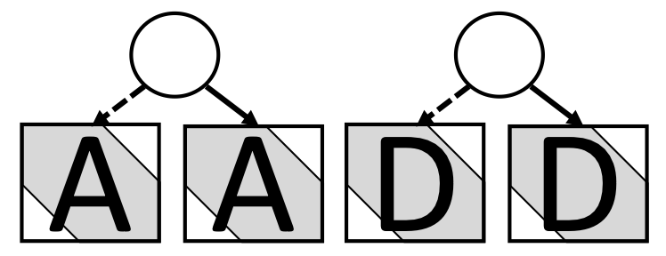

# AADD

#### Semi-Symbolic Computation with Decision Diagrams (DDs), Constrained Affine Arithmetic (AA), and more. 

(c) University Kaiserslautern-Landau, Chair of Cyber-Physical Systems




## What the AADD library does
The AADD library enables **semi-symbolic computations** over Reals (Doubles), Integers, and Booleans.
These are represented by sets of convex ranges; likewise, operations are done on sets of convex ranges.
We split the ranges by a (generalize) Shannon Decomposition to a more general set-representation. 
The results guarantee **safe inclusion**: no possible results are lost, and high performance 
and scalability to **numerical problems with complex control** flow are achieved. 

Use cases include 

- **Reachability analysis** by abstract execution in general, 
- **Formal verification** of mixed discrete/continuous and control systems, 
- **Type inference and verification** in software systems, 
- Development of tools for **constraint propagation and reasoning**, e.g., SMT solvers.

What the AADD library does can be seen by a tiny code-example in Kotlin: 

```
   import io.github.tukcps.aadd.*

   fun main() = DDBuilder {
      val x: Real = real(-1.0 .. 1.0, "x")
      val f: Real = ite(x greaterEquals 0.0, x-100.0, x+100.0)
      val g: Real = f/2     // also nonlinear functions
      println(" f = $f")
   }
```

The resulting output is a Shannon Decomposition (with index 1 linking to a condition):
```
    f = ITE(1, [-50; -49.5], [49.5; 50]) 
```

To reduce over-approximation, the AADD library implements a number of state-of-the-art techniques, including

- Reals with **directed rounding** on the JVM platform (Double + TwoSum and other algorithms),
- Integers with **Infinities** and handling of overflow (Long + Kotlin), 
- **Adaptive, Constrained** Affine Arithmetic (AA) with
  - Taylor, Chebychev/MinMax, and other linear approximations, 
  - Combination with interval arithmetic where useful,
  - Automatic **reduction of noise terms**, 
  - (WiP) Caching of intermediate results,
  - Minimization of overapproximation by an LP solver.
  - **Splitting of image** where useful (WiP) is represented by **Shannon Decomposition in decision diagrams (DD)**, 
  - Also, **linearized constraints** are represented as Shannon Decomposition in decision diagrams (DD), allowing us
  to profit from BDD-like reduction techniques on AADDs and IDDs. 
  - Possibility to model discrete computations with BDD (Bool),
  - BDD (Bool) can be used to control continuous computations (IF, THEN, ELSE, LOOP, etc.), and

To the best of our knowledge, the last four techniques are unique to the AADD library.
They allow us to achive in suitable applications like reachability analysis a high performance and scalability to
numerical algorithms far beyond linear filters. 

However, note: 
> For purely Boolean problems, optimized BDD packages or a SAT solver are likely better suited.

Also, the AADD library does not provide a complete SMT solver -- but it can be used to develop such tools.

To learn more:

- Grimm et al. DAC 2017; https://dl.acm.org/doi/abs/10.1145/3061639.3072949
- Grimm et al., EPTCS 247, 2017, pp. 1-17; https://doi.org/10.4204/EPTCS.247.1
- Zivkovic et al., IEEE TCAD 38/10 2019;  https://ieeexplore.ieee.org/document/8428606
- Zivkovic et al., DATE 2019; http://dx.doi.org/10.23919/DATE.2019.8715278

For a complex project base on the AADD library, check SysMD Notebook on GitHub: https://github.com/tukcps/SysMD.

## Contents and Use of the AADD Library

The implementation is a **Kotlin Multiplatform Project**.
This means, that Kotlin generates both JAR files for the Java Virtual Machine platform
and binary shared libraries (for use from C/C++, ...).

The development environment is:
- Gradle 8.5+ as build tool
- Kotlin v2.4+ which compiles to Java 21+ Byte code or various binary platforms, 
- Kotlin test for unit testing, 

The Gradle build tool automatically downloads all dependencies.
The multi-platform version includes a simple LP solver (which is ok as most LP problems in AADD are small ones, where the overhead for starting a complex solver is expensive).
For the JVM platforms, other solvers for LP/MILP problems like OjAlgo will be used in the next updates.

To include the AADD library in an application, add the following dependency to your Gradle dependencies (and add 
[](https://mvnrepository.com/artifact/io.github.tukcps/aadd)
to your repositories): 
```
    implementation("io.github.tukcps:aadd:0.9.1") // Check for newer versions!  
```
If you use Gradle (or Maven) as build tool, these will download and use the respective version 
(i.e., 0.9.1) automatically, and you just can use it in your code.
If you prefer compiling the code by yourself: 
```
    gradle build
```

To quickly try some pre-existing examples, it is suggested to use IntelliJ IDEA (https://www.jetbrains.com/idea/), 
and to import the Gradle project.
Navigate to "src/test," and right-click on an example to run it. 

## Semi-Symbolic Computations with the AADD library

The AADD library allows users execute code in a semi-symbolic way.
For this purpose, it provides representations of variables and constants of the types

- Real 
- Integer 
- Bool 
- String (just a toy extension)

Variables and constants are created a factory and builder class instance ```DDBuilder```. 
This object maintains all information on dependencies and interactions. 
Representations. 
To create variables/constants, the builder must be instantiated. 
Then, its methods can be used to create new variables and constants, e.g., in Kotlin: 
```
   import io.github.tukcps.aadd.*

   fun main() = DDBuilder {
      val x: Real = real(-1.0 .. 1.0, "x")
      val f: Real = ite(x greaterEquals 0.0, x-100.0, x+100.0)
      println(" f = $f")
      // Displays: f = ITE(1, [-100,00; -99,00], [99,00; 100,00])
   }
```
For other platforms, the respective functions must be called in the respective language, e.g., Java, or C++. 
Note that a DDBuilder has a single abstract method as parameter. 
This allows users to pass lambda parameters that are executed, e.g., for configuration or direct computations.
To do computations, AADD provides a vast set of arithmetic and boolean functions.
For Kotlin, also overloaded operators are provided. 
Below an example: 
```
   DDBuilder {
      val a = real(-1.0 .. 1.0, "a")
      val y = a - a + 1.0
   }
```
The results of the computations can be accessed via the field ```.value``` resp. ```.min``` and ```.max``` as 
the respective type (Double, Long integer, Bool, or String). 
Furthermore, the method `.toString` returns a suitable string. 
````
      println("a = $a")    //    -1.0 .. 1.0
      println("y = $y")    //    1.0 
````

### Configuration parameters of DDBuilder 


### AADD and BDD combined and DSL

Imagine the following pseudocode program, e.g., in Kotlin, C++, Java in : 
```
    var a = Real(-1.0, 1.0) // precondition: a has a value in -1..1
    if (a > 0.0) 
        a = a + 10.0 
    else 
        a = a - 10.0
    println("a = "+a)       // Now, a is either (0..1] + 10 , or [-1 ..0] - 10.0
```
We can symbolically execute it by using IF, ELSE, END and assignS.
With the help of the class DDBuilder that provides DSL features, we can write
```
    DDBuilder {
         var a = Real(-1.0, 1.0)
         IF(a greaterOrEquals 0.0)  // Macro that saves condition
             a=a.assignS(a+10.0)    // Condition is considered by solver
         ELSE()                     // Condition is negated
             a=a.assignS(a-10.0)    // Negated condition is considered by solver 
         END()
         println("a = $a")
    }
```
More complete documentation is in the folder doc. 

### Multiplatform Utilization
The `AADD` library is a Multiplatform Project, enabling the generation of a shared C library. 
Such a shared library can be used within C++/C code projects. 
Here's how the workflow operates:

1. **Build the Project**: 
   - Use Gradle to build the project as usual. This process will generate a shared library:
     - `libnative.dylib` on macOS
     - `libnative.so` on Linux
     - `libnative.lib` on Windows
   - The library will be located in `build/bin/native/<debugShared, releaseShared>`.

2. **Linking the Library**: 
   - Alongside the shared library, a header file is available in the same directory. Use this to link against your C/C++ projects.

Here's an example of how to use the library in C++:

```cpp
#include <iostream>
#include "libnative.h"

int main() {
    libnative_ExportedSymbols* lib = libnative_symbols();
    libnative_kref_com_github_tukcps_aadd_DDBuilder builder = lib->kotlin.root.com.github.tukcps.aadd.DDBuilder.DDBuilder();
    libnative_KDouble x1_min = 0.0;
    libnative_KDouble x1_max = 1.0;
    const char* x1_name = "x1";
    libnative_kref_com_github_tukcps_aadd_AADD x1 = lib->kotlin.root.com.github.tukcps.aadd.DDBuilder.range_(builder, x1_min, x1_max, x1_name);
    
    std::cout << "x1 = [" << lib->kotlin.root.com.github.tukcps.aadd.AADD.get_min(x1) 
              << ", " << lib->kotlin.root.com.github.tukcps.aadd.AADD.get_max(x1) << " ]" << std::endl;

    return 0;
}
```
For more detailed information on utilizing multiplatform shared libraries, please refer to [the official Kotlin documentation.](https://kotlinlang.org/docs/native-dynamic-libraries.html)

### API Changelog

#### Multiplatform (MP-) AADD 

##### Versions MP-AADD 0.9-0.9.X
- API fixes towards 1.0 (but quite stable now)
- Slightly simplified numerical methods in favor of maintainability, architecture 
- Temporarily dropped some very use-case-specific features 

##### Versions MP-AADD 0.1-0.1.X 
- Not for external use as not fully mature API
- API exploration, scalability checks, ... 
- In DDBuilder: range and scalar replaced by real, integer, string.

##### Versions MP-AADD 0.0.1-0.0.9
- Transition of the project to a multi-platform project 
- refactor jaadd to aadd in several classes/package names to match new project name that is AADD only (no j for Java)

#### jAADD (deprecated; continued as Multiplatform-AADD)
##### Version 3.8+ (jAADD)
- last jaadd versions; added new builder functions from MP-AADD to make transition easier

##### Version 3.0
- Common interface ```NumberRange``` for all classes that model ranges.
- ```BDD``` leaves hold ```XBool``` values, not ```Boolean``` values.
- Sealed classes and interfaces for ```DDref```, ```BDD```, ```AADD```, ```IDD```, ```StrDD``` allow complete modeling without nullable references.
- IA can continue computation in case of Infinite/NaN bounds and open intervals

##### Version 2.8, 2.9
tests and operations on IDD and StrDD classes. 

##### Version 2.7pure
just the AADD classes, without constraint-net, parser, ui, etc.

##### Version 2.6
AADDLeaf, AADD become sealed class AADD with AADD.Leaf and AADD.Internal

##### Version 2.5
Simplified language of parser, everything via def: statement. 
Property part of parser and symbol table

##### Version 2.4
Replaced Context by DDBuilder that includes DSL elements; combines builder and factory patterns. 

##### Version 2.2, 2.3
None. 
Only interface declarations were added which allows delegation and nicer use of AADD Context. 

##### Version 2.1 
The version 2.1 introduces different factories (Context) which permits different independent instances of AADD/BDD. 

##### Version 2.0 (Kotlin JVM)
Version 2.0 comes with some modifications in the API
to permit interoperability with Kotlin, or to clean up the API.
The following are the changes:

1. Use of getter/setter methods and adapted names following Java naming conventions for all fields. The following fields are concerned:

    * getMin() and getMax() replace the fields min and max fields of Range and AADD that are private now.
    * getValue() replaces Value() as getter for the field value in BDD and AADD.
    * getResult() replaces in the expression parser the field result that is private now. 
    * several methods, e.g., range(...), scalar(...) now start with a small letter as usual in Java.

2. Renaming of arithmetic functions to their respective operator names.
For example:
    * x.sum(y) has become x.plus(y)
    * x.mul(y) has become x.times(y)

3. The method names in the factories for BDD and AADD have been renamed. 
    * BDD.constant(boolean) replaces BDD.newLeaf(Boolean)
    * BDD.variable("X") replaces BDD.Bool("X").

4. AADDMgr has been split into static fields or methods of the respective classes AADD or BDD.
Only the AADD and BDD streams remain in the class AADDstreams.


##### Version 1.0-1.3 (Java version)
Initial proof-of-concept written in Java
